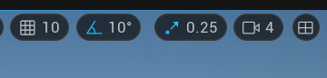

# UE5 Tutorial
URL: https://github.com/kebwlmbhee/Computer_Project

Source: https://www.bilibili.com/video/BV1Ly4y1579C

## 人物相關操作
中鍵按住加滑鼠 => 平移

Alt + 滑鼠左鍵 => 視角 

滑鼠中鍵 => 前後 

**移動 => 右鍵 + WASDQE(前左後右上下)**

移動人物的速度控制 => 右鍵 + 中鍵前後滾(前滾為加速)

## 物體快捷鍵
Q => 選取物件

*以下可用空格切換*
```
W => 物件平移軸

E => 物件旋轉軸

R => 物件縮放軸
```

**F => 聚焦物件**

## 上方圖示快捷

    
左三依序分別對應平移、旋轉、縮放

藍色若亮起顯示鎖定狀態，平旋縮皆以該單位為主

藍色未亮起(呈白色)則為解鎖狀態，以順滑方式平旋縮
    
相機速度 => 視角移動速度

## 縮放

使用 X、Y、Z 後方的軸線 => 等比例縮放

## 其它快捷鍵

Alt + 平移 => 用滑鼠拉出同位置複製物件

Ctrl + W => 複製物件疊於上方

Ctrl + L + 移動滑鼠 => 控制太陽光照的時間

END 鍵 => 使物件貼平地面

## 側欄
default 為隱藏側欄

Ctrl + 空格 => Content Drawer(資產檔案夾)

Dock in layout => 停靠於布局，鎖定

關閉即回復 default

## Create Material
Open Content Drawer => Create New Folder => Choose Object and Create New Material => Double Click to Open BluePrint

## BluePrint
左鍵拖拉 => 選取

右鍵拖拉 => 移動視角

中鍵滾輪 => 視角大小

*以下操作可直接用右鍵點擊或右側 Palette 搜索名稱*
```
3 + 左鍵 => 產生 Constant3vector，三向量節點

2 + 左鍵 => 產生 Constant2Vector，二向量節點

1 + 左鍵 => 產生控制大小的按鍵，單一向量節點

U + 左鍵 => TextureCoordinate，控制 UV 大小(即貼圖內部的元素大小)

Alt + 左鍵點擊 => Disconnect link

Ctrl + 左鍵點擊 => Change and replace link

M + 左鍵 => Multiply，應用 A、B 接口可疊加

L + 左鍵 => LinearInterpolate，(100% of A whenAlpha = 0 and 100% of B when Alpha = 1)
```

設置變數名稱，選用 StaticSwitchParameter

## git

Edit -> Connect to Source Control -> Provider (Git bata version)

## C++

Tools -> New C++ Class

the new file will appear in "Source" folder

## git lfs (將檔案以以 TXT 的形式儲存)
### Github 的 LFS 容量為 1GB (free account)
```
// filter > 10mb file
git lfs track 10mb.psd

// lfs folder recursively
git lfs track "MyFolder/**"

// pull 下來, > 10 mb 的檔案都會變成文字檔，若需要在 Github 抓取 lfs 原始檔案
git lfs pull

// remove local file which don't exist remote
git lfs prune
```